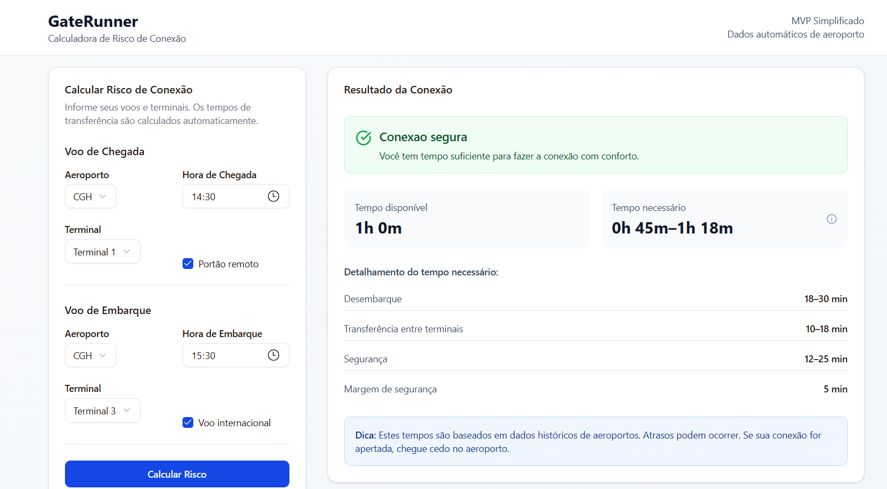

# GateRunner
A production-style data science project modeling real-world airport connection risk using probabilistic timing distributions.
## Why this project matters

Flight connections are one of the most common operational risks in aviation.
Missed connections cost airlines millions yearly and affect passenger satisfaction.
GateRunner models this decision process using timing uncertainty instead of fixed thresholds.

---

GateRunner is a data-driven application that predicts whether a passenger can safely make a flight connection.
## Tech Stack

- React
- Node.js
- TypeScript
- JSON-based airport configuration models

---

## Problem

Passengers often misjudge whether their connection time is sufficient, especially in unfamiliar airports.  
GateRunner estimates the real time required for a connection using operational airport timing models.

---

## Methodology

The model decomposes connection time into:

- aircraft deplaning time
- terminal transfer time
- security processing time
- operational buffer

Each component uses statistical timing ranges (p50 / p90).

If an airport is not configured, the system uses a generic airport profile to estimate timings.

---

## Output

Connections are classified as:

- SAFE
- TIGHT
- RISKY

---

## How to run

1. Clone the repository
git clone https://github.com/Danalytiks/Gaterunner.git
cd gaterunner-mvp

2. Install dependencies
Make sure you have Node.js installed.
pnpm install

3. Run the development server
pnpm run dev

4. Open the application

Open your browser and go to:
http://localhost:3000

Prerequisites
* Node.js (LTS)
* pnpm

If pnpm is not installed:

corepack enable
corepack prepare 
pnpm@latest --activate

