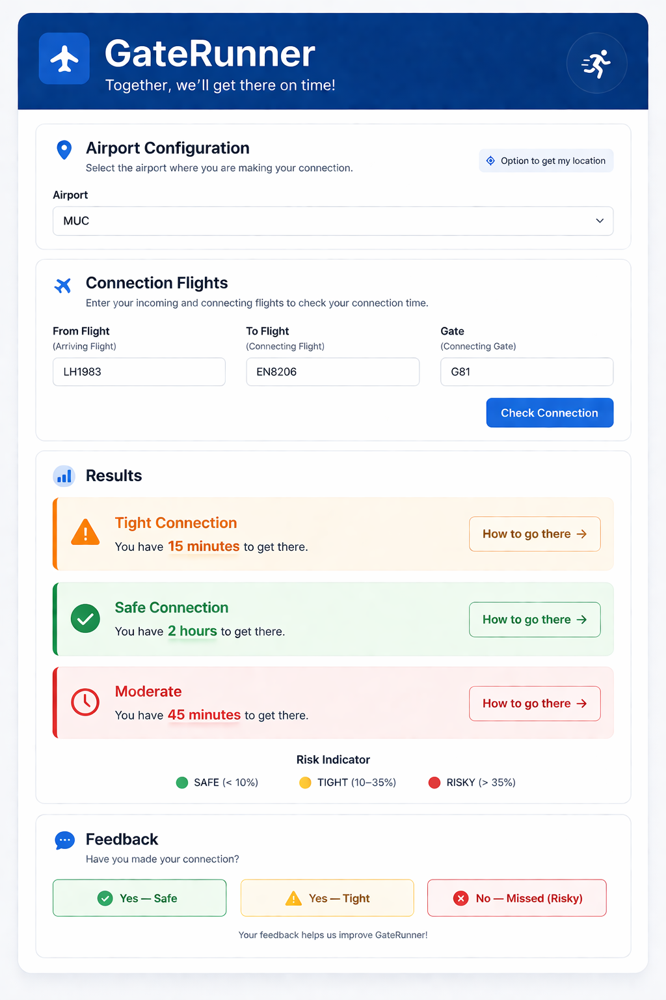
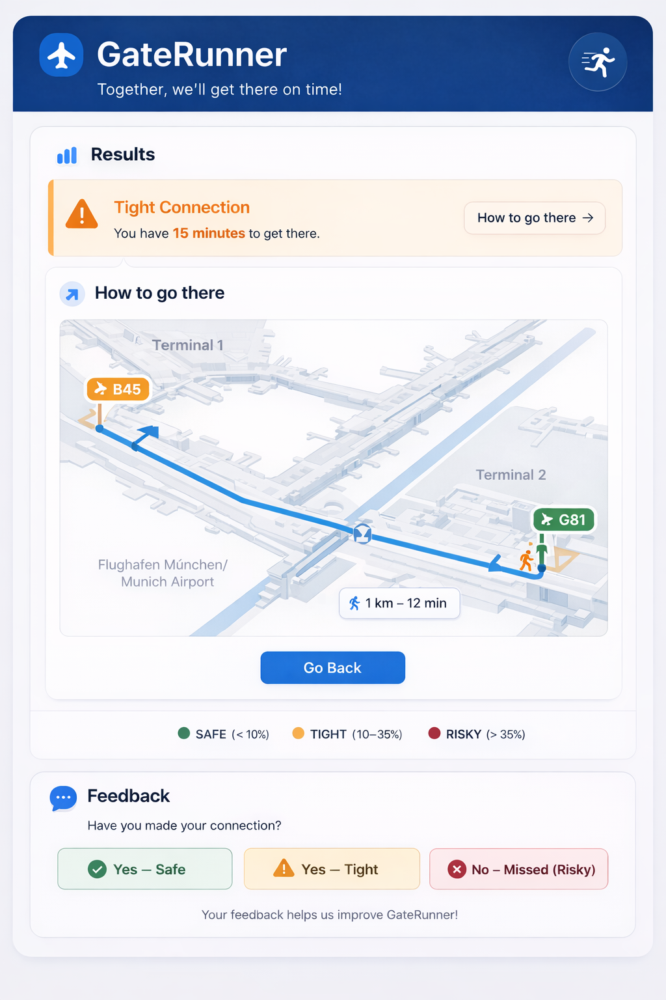

# ✈️ GateRunner

> **"Together, we'll get there on time!"**

GateRunner is a React prototype that helps passengers with tight connections navigate **Munich Airport (MUC)** quickly and confidently — built by someone who works there.

🔗 **[Live Demo →](https://gaterunner.vercel.app)**

---

## 🎨 Visual Reference

| Main Screen | Map Screen |
|---|---|
|  |  |

---

## 🧭 The Problem

Short layovers + unfamiliar airport = missed flights.

Airports can be overwhelming, especially for:
- 👴 Elderly travelers
- 🧳 Occasional flyers
- ⏱️ Passengers with tight connections

Often the time **is** sufficient — but passengers don't know the route and miss their flight anyway. GateRunner solves that.

---

## 📊 Data-Driven Risk Classification

The Safe / Tight / At Risk thresholds used in GateRunner are validated by a data analysis of **10 million US domestic flights (2024)**.

> 🔬 **[See the full analysis →](https://github.com/Danalytiks/flight-delay-connection-risk-analysis)**

| Status | Buffer | Share of flights |
|---|---|---|
| 🟢 Safe | > 20 min | 77.96% |
| 🟡 Tight | 5–20 min | 12.83% |
| 🔴 At Risk | < 5 min | 7.57% |

---

## 🚀 What It Does

1. **Enter your flight numbers** — incoming + connecting
2. **Auto-lookup** of arrival gate, departure gate, and time to boarding
3. **Instant risk classification**: Safe 🟢 / Tight 🟡 / At Risk 🔴
4. **Step-by-step directions** tailored to MUC's real layout
5. **Visual airport map** with animated route
6. **Passenger feedback loop** for continuous improvement

---

## 🏗️ MUC Airport Architecture

| Zone | Piers | Gates | Level | Connection to T2 |
|---|---|---|---|---|
| Terminal 1 | A | A01–A43 | 04 | Free shuttle bus (5–7 min) |
| Terminal 1 | B | B01–B17 | 04 | Free shuttle bus (5–7 min) |
| Terminal 1 | C | C01–C30 | 04 | Free shuttle bus (5–7 min) |
| Terminal 1 | D | D01–D23 | 04 | Free shuttle bus (5–7 min) |
| Terminal 1 | E | E01–E99 (VIP Wing) | 04 | Free shuttle bus (5–7 min) |
| Terminal 2 Main | G | G01–G48 | 04 | — |
| Terminal 2 Main | H | H01–H48 | 05 | — |
| T2 Satellite | K | K01–K30 | 04 | Satellite train (every 4 min, ≈ 2 min) |
| T2 Satellite | L | L01–L30 | 05 | Satellite train (every 4 min, ≈ 2 min) |

**T1 ↔ T2:** Free shuttle bus every 10 min (07:00–17:00) / 20 min off-peak · Or walk via MAC

---

## 🛠️ Stack

| | |
|---|---|
| Framework | React + Vite |
| Icons | Lucide React |
| Styling | CSS-in-JS |
| Airport Data | Calibrated MUC walking time matrix (private) |
| Deploy | Vercel |

---

## 📐 Architecture

\`\`\`
src/
├── App.jsx
├── data/
│   └── mucData.js        # 🔒 Private
└── components/
    ├── Card.jsx
    ├── Header.jsx
    ├── AirportConfiguration.jsx
    ├── ConnectionFlights.jsx
    ├── Results.jsx
    ├── ResultCard.jsx
    ├── RiskIndicator.jsx
    ├── Feedback.jsx
    └── HowToGoThere.jsx
\`\`\`

---

## 🗺️ Roadmap

- [ ] Live flight API integration
- [ ] Real-time gate change alerts
- [ ] Multi-language support (EN / DE / PT)
- [ ] Frequent flyer mode (gate info only)
- [ ] Accessibility mode
- [ ] Expansion to other airports

---

## 👨‍💻 Author

**Dani** — Munich Airport (MUC) operations + Data Science

---

*GateRunner — because every minute counts.* ⏱️
